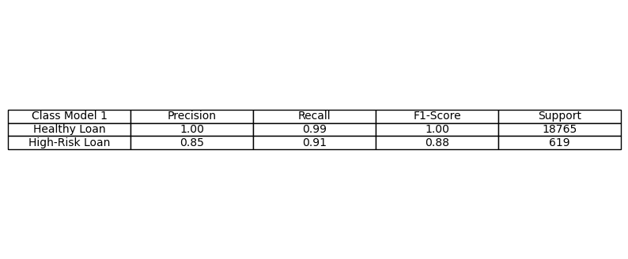

# credit-risk-classification

## Overview of the Analysis

In this section, describe the analysis you completed for the machine learning models used in this Challenge. This might include:

* Explain the purpose of the analysis.
* Explain what financial information the data was on, and what you needed to predict.
* Provide basic information about the variables you were trying to predict (e.g., `value_counts`).
* Describe the stages of the machine learning process you went through as part of this analysis.
* Briefly touch on any methods you used (e.g., `LogisticRegression`, or any resampling method).

## Results

Using bulleted lists, describe the balanced accuracy scores and the precision and recall scores of all machine learning models.

* Machine Learning Model 1:

<<<<<<< HEAD
=======

>>>>>>> 7d405208967aa466c39272be18cddb7977ec0129

**Question:** How well does the logistic regression model predict both the `0` (healthy loan) and `1` (high-risk loan) labels?

**Answer:** 
Model precision: the precision (which measures the accuracy of positive predictions made by the model, in other words, number of correct positive predictions), shows that for healthy loans, (0), the model accuracy is very high - 100%. For high-risk loans the model accuracy is 85%. This means that the model has a very low rate of false positives for the healthy loans (basically 100% accuracy), but it is not 100% accurate in identifying all the false positives for the high-risk loans.

Model recall: which is the true positive rate for the total number of positive predictions. For health loans,(0), it can predict 99% of positive and for unhealthy 91% of total positive, meaning, that the model has a low rate of false negatives for healthy loans, and a very fairly rate for high-risk loans; although it cannot predict all the false negatives for the high-risk loans.

F1 = which is the mean of the precision and recall and considers both the false positives (precision) and false negatives (recall).

In general, the model is highly efficient in predicting the healthy loans and has a moderate to high precision to predict the high-risk loans, but still a very accurate model.

* Machine Learning Model 2:
<<<<<<< HEAD

=======

>>>>>>> 7d405208967aa466c39272be18cddb7977ec0129

**Question:** How well does the logistic regression model, fit with oversampled data, predict both the `0` (healthy loan) and `1` (high-risk loan) labels?

**Answer:** 
Model precision: the precision (which measures the accuracy of positive predictions made by the model, in other words, number of correct positive predictions), shows that the model accuracy is very high - 100% for both healthy and a moderate accuracy of 84% for high-risk loans. This means that the model has a very low rate of false positives for healthy loans, but a moderate rate for high-risk loans.

Model recall: which is the true positive rate for the total number of positive predictions. The model predict 99% of total positive, meaning, that the model has a low rate of false negatives for both healthy and high-risk loans.

F1 = which is the mean of the precision and recall and considers both the false positives (precision) and false negatives (recall).

## Summary

In general, the logistic regression model 2 is highly efficient in predicting the healthy and high-risk loans with a balance accuracy of 99% versus the  balance accuracy of 95% calculated under model 1.
